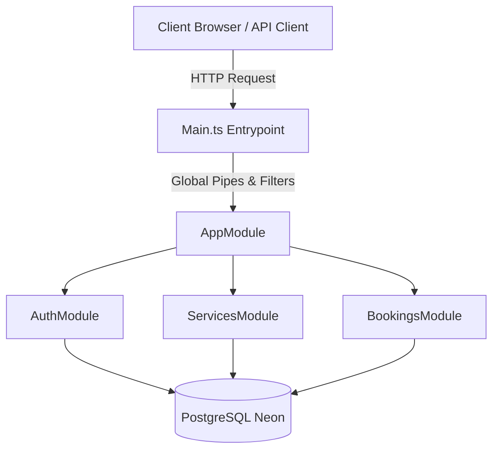
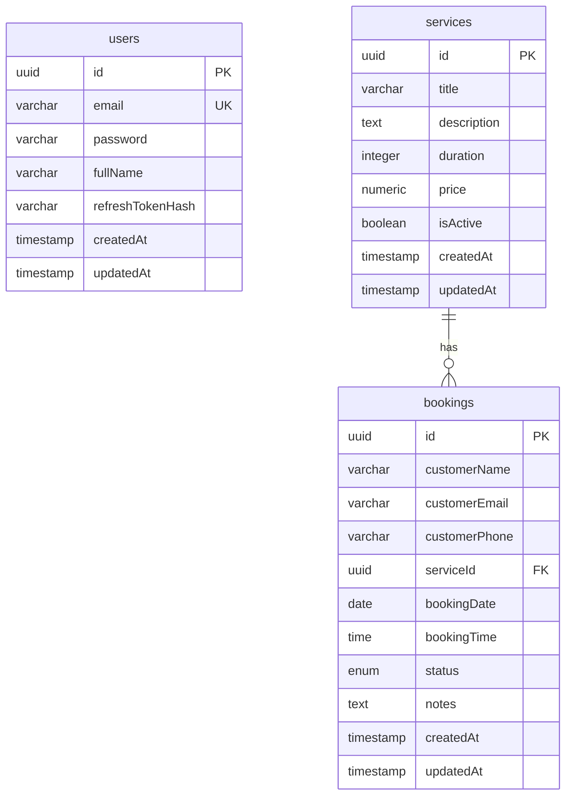

# Software Requirements Specification (SRS)

## Project: Booking Platform REST API
*   **Tech Stack**: NestJS, TypeScript, TypeORM, PostgreSQL (Neon), JWT Auth
*   **Production Deployment URL**: [https://nestjs-booking-platform.onrender.com/api/docs](https://nestjs-booking-platform.onrender.com/api/docs)
*   **GitHub Repository**: [https://github.com/Lokeessshhh/nestjs-booking-platform](https://github.com/Lokeessshhh/nestjs-booking-platform)

---

## 1. Introduction

### 1.1 Purpose
This document specifies the software requirements for the Booking Platform REST API. It outlines the system features, database schema, API contracts, business rules, and security designs to serve as the definitive specification for the platform.

### 1.2 Scope
The Booking Platform is a backend REST API built to manage business services and customer scheduling. It supports two user scopes:
1.  **Service Managers (Authenticated)**: Authorized to manage service catalogs, monitor all customer bookings, change booking statuses, and rotate access credentials.
2.  **Customers (Public)**: Allowed to query active services and schedule appointments without requiring credentials.

### 1.3 Definitions and Acronyms
*   **JWT**: JSON Web Token, used for securely transmitting information between parties as a JSON object.
*   **Access Token**: A short-lived JWT used to access protected endpoints.
*   **Refresh Token**: A long-lived JWT used to request a new Access Token.
*   **TypeORM**: An Object-Relational Mapper (ORM) for TypeScript/JavaScript.
*   **Neon**: A serverless cloud PostgreSQL hosting provider.
*   **REST**: Representational State Transfer, an architectural style for network applications.

---

## 2. System Overview

The system is developed using a modular architecture pattern in NestJS. By structuring domains into isolated feature modules (`AuthModule`, `ServicesModule`, `BookingsModule`), the system maintains high modularity, scalability, and testability.

---

## 3. Functional Requirements

### 3.1 Authentication Module
*   **FR-AUTH-1 (Registration)**: Managers must be able to register using a unique email address, password, and full name.
*   **FR-AUTH-2 (Login)**: Registered managers must be able to authenticate using their email and password to receive a JWT access token and a refresh token.
*   **FR-AUTH-3 (Token Refresh)**: The system must support generating a new access token using a valid, unrevoked refresh token.
*   **FR-AUTH-4 (Logout)**: Authenticated managers must be able to log out, which revokes the active refresh token in the database.

### 3.2 Service Management Module
*   **FR-SRV-1 (Create Service)**: Authenticated managers must be able to create new services specifying title, description, duration (minutes), and price.
*   **FR-SRV-2 (Update Service)**: Authenticated managers must be able to edit any parameters of an existing service.
*   **FR-SRV-3 (Delete Service)**: Authenticated managers must be able to delete a service. The deletion is blocked if the service has active bookings associated with it.
*   **FR-SRV-4 (Get Services)**: 
    *   **Public Users**: Must be able to list only active services (`isActive: true`).
    *   **Managers**: Must be able to list all services (active and inactive).
*   **FR-SRV-5 (Get Service by ID)**: Users must be able to query details of a single service. Inactive services must return `404 Not Found` for public users.

### 3.3 Booking Management Module
*   **FR-BKG-1 (Create Booking)**: Public users (customers) must be able to schedule a booking by providing customer name, email, phone, service ID, booking date (`YYYY-MM-DD`), and booking time (`HH:MM`).
*   **FR-BKG-2 (Get All Bookings)**: Authenticated managers must be able to fetch all bookings, supporting pagination, keyword search, and status filtering.
*   **FR-BKG-3 (Get Booking by ID)**: Authenticated managers must be able to query a specific booking's details.
*   **FR-BKG-4 (Update Status)**: Authenticated managers must be able to update a booking's status (`PENDING`, `CONFIRMED`, `CANCELLED`, `COMPLETED`).
*   **FR-BKG-5 (Cancel Booking)**: Authenticated managers must be able to cancel a booking directly.

---

## 4. Non-Functional Requirements

### 4.1 Security
*   **Password Hashing**: Passwords must be hashed using `bcrypt` (10 salt rounds) before database storage.
*   **Token Expirations**: Access tokens must expire in 15 minutes. Refresh tokens must expire in 7 days.
*   **Refresh Token Safety**: Refresh tokens must be hashed and stored in the database. Upon token rotation or logout, the hash is updated or cleared, preventing reuse.
*   **SSL Enforcement**: All database connections to Neon Postgres must enforce SSL mode (`sslmode=require`).

### 4.2 Validation & Exception Handling
*   **Input Validation**: Request payloads must be strictly validated at the controller boundary using `class-validator` and `class-transformer` (e.g. email formats, UUID validation, date formats, non-negative numbers).
*   **Payload Sanitization**: Whitelisting must be enabled globally to strip unrecognized request properties.
*   **Global Exception Filtering**: Unhandled server errors must be caught and returned as structured JSON payloads containing statusCode, path, timestamp, message, and validation sub-errors where applicable.

---

## 5. Database Design

### 5.1 Entities Specification

#### 5.1.1 User Entity (Table: `users`)
| Column Name | Data Type | Constraints | Description |
| :--- | :--- | :--- | :--- |
| `id` | `uuid` | PK, Default: UUIDv4 | Unique identifier for the user |
| `email` | `varchar` | Unique, Indexed | Manager login email address |
| `password` | `varchar` | Select: false | Bcrypt hashed password string |
| `fullName` | `varchar` | Not Null | Display name of the manager |
| `refreshTokenHash` | `varchar` | Nullable, Select: false | Hashed active refresh token |
| `createdAt` | `timestamp` | Default: `now()` | Record creation timestamp |
| `updatedAt` | `timestamp` | Default: `now()` | Last modification timestamp |

#### 5.1.2 Service Entity (Table: `services`)
| Column Name | Data Type | Constraints | Description |
| :--- | :--- | :--- | :--- |
| `id` | `uuid` | PK, Default: UUIDv4 | Unique identifier for the service |
| `title` | `varchar` | Not Null | Title of the service |
| `description` | `text` | Not Null | Detailed description |
| `duration` | `integer` | Not Null, Min: 1 | Duration in minutes |
| `price` | `numeric(10,2)` | Not Null, Min: 0.00 | Fee, parsed as float |
| `isActive` | `boolean` | Default: `true` | Visibility toggle |
| `createdAt` | `timestamp` | Default: `now()` | Record creation timestamp |
| `updatedAt` | `timestamp` | Default: `now()` | Last modification timestamp |

#### 5.1.3 Booking Entity (Table: `bookings`)
| Column Name | Data Type | Constraints | Description |
| :--- | :--- | :--- | :--- |
| `id` | `uuid` | PK, Default: UUIDv4 | Unique identifier for the booking |
| `customerName` | `varchar` | Not Null | Customer's full name |
| `customerEmail` | `varchar` | Not Null, Valid Email | Customer's email |
| `customerPhone` | `varchar` | Not Null | Customer's contact phone number |
| `serviceId` | `uuid` | FK (services.id), Indexed | Linked service identifier |
| `bookingDate` | `date` | Not Null | Appointment date (YYYY-MM-DD) |
| `bookingTime` | `time` | Not Null | Appointment time (HH:MM) |
| `status` | `enum` | Default: `PENDING` | `PENDING`, `CONFIRMED`, `CANCELLED`, `COMPLETED` |
| `notes` | `text` | Nullable | Customer special requests |
| `createdAt` | `timestamp` | Default: `now()` | Record creation timestamp |
| `updatedAt` | `timestamp` | Default: `now()` | Last modification timestamp |

*   **Indexes**:
    *   `idx_booking_service_datetime_unique` (Unique Partial Index):
        `ON bookings (serviceId, bookingDate, bookingTime) WHERE status != 'CANCELLED'`

---

## 6. API Endpoint Contracts

All routes except those marked as **Public** require JWT Bearer Authentication (`Authorization: Bearer <access_token>`).

### 6.1 Authentication Endpoints
*   **POST** `/api/auth/register` (Public)
    *   *Body*: `{ email, password, fullName }`
    *   *Response*: `201 Created` with User object (excluding password fields).
*   **POST** `/api/auth/login` (Public)
    *   *Body*: `{ email, password }`
    *   *Response*: `200 OK` with user info, access token, and refresh token.
*   **POST** `/api/auth/refresh` (Public - Requires Refresh Token in Header)
    *   *Header*: `Authorization: Bearer <refresh_token>`
    *   *Response*: `200 OK` with new access token and rotated refresh token.
*   **POST** `/api/auth/logout` (Auth Required)
    *   *Response*: `200 OK` (token invalidated in database).

### 6.2 Service Endpoints
*   **POST** `/api/services` (Auth Required)
    *   *Body*: `{ title, description, duration, price, isActive? }`
    *   *Response*: `201 Created` with new Service object.
*   **GET** `/api/services` (Public / Optional Auth)
    *   *Query*: `{ page?, limit? }`
    *   *Response*: `200 OK` with paginated services. (Filters out inactive services if no auth header).
*   **GET** `/api/services/:id` (Public / Optional Auth)
    *   *Response*: `200 OK` with Service details. (Throws 404 if inactive and user is not manager).
*   **PUT** `/api/services/:id` (Auth Required)
    *   *Body*: `{ title?, description?, duration?, price?, isActive? }`
    *   *Response*: `200 OK` with updated Service object.
*   **DELETE** `/api/services/:id` (Auth Required)
    *   *Response*: `204 No Content` (blocked if associated with active bookings).

### 6.3 Booking Endpoints
*   **POST** `/api/bookings` (Public)
    *   *Body*: `{ customerName, customerEmail, customerPhone, serviceId, bookingDate, bookingTime, notes? }`
    *   *Response*: `201 Created` with new Booking object.
*   **GET** `/api/bookings` (Auth Required)
    *   *Query*: `{ page?, limit?, status?, search? }`
    *   *Response*: `200 OK` with paginated, filtered bookings.
*   **GET** `/api/bookings/:id` (Auth Required)
    *   *Response*: `200 OK` with Booking details.
*   **PATCH** `/api/bookings/:id/status` (Auth Required)
    *   *Body*: `{ status }`
    *   *Response*: `200 OK` with updated Booking object.
*   **PATCH** `/api/bookings/:id/cancel` (Auth Required)
    *   *Response*: `200 OK` (updates status to `CANCELLED`).

---

## 7. Business Rules

### BR-1: Service Linkage
*   A booking request must contain a valid `serviceId` referencing a service already in the database. 

### BR-2: Active Service Bookings
*   Bookings can only be scheduled for active (`isActive: true`) services. If a service is marked inactive, new bookings are rejected.

### BR-3: No Past Appointments
*   Booking dates and times cannot be in the past relative to the server's current timestamp.
*   *Validation Check*: Combined date (`YYYY-MM-DD`) and time (`HH:MM`) must be strictly greater than the current local system timestamp.

### BR-4: Booking Slot Conflict Prevention
*   For any single service, a date and time slot can only be held by one active booking.
*   *Conflict Resolution*: Before creating a booking, check for any booking with matching `serviceId`, `bookingDate`, and `bookingTime` where `status` is NOT `CANCELLED`. Throw `409 Conflict` if found.

### BR-5: Terminal Status Transitions
*   `CANCELLED` and `COMPLETED` booking states are permanent terminal states.
    *   If a booking is cancelled, its status cannot be changed.
    *   If a booking is completed, its status cannot be changed.
    *   Any update request violating this yields a `400 Bad Request`.

---

## 8. Assumptions Made

1.  **Staff Scope**: Only registered store managers use the authentication system. Customers interact with the scheduler anonymously.
2.  **Booking Cancellations**: Only authenticated managers have authorization to review, confirm, complete, or cancel bookings.
3.  **Active Slot Availability**: If a booking is cancelled, that slot is instantly available for scheduling by other customers.
4.  **Date-Time Storage**: Date parameters are formatted as `YYYY-MM-DD` strings, and time parameters are formatted as `HH:MM` strings, aligning with standard database SQL `date` and `time` data types to prevent timezone drift.
